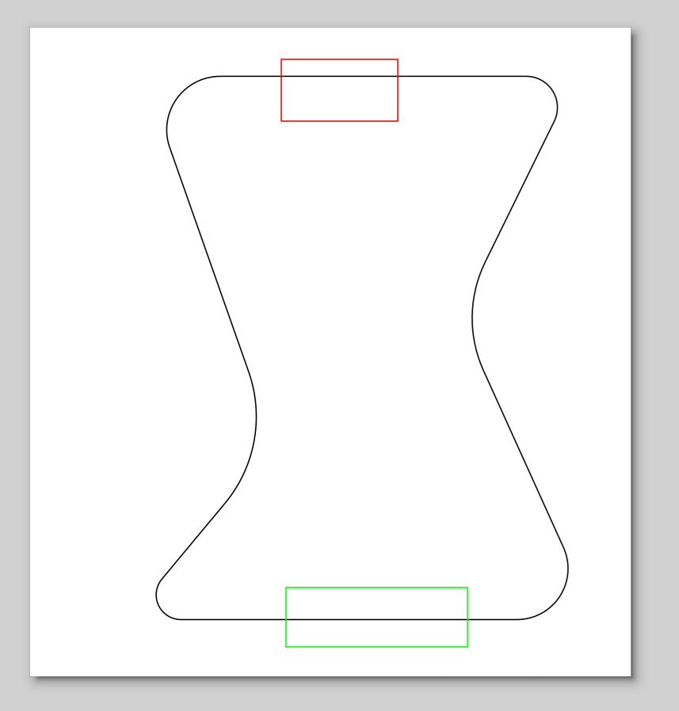
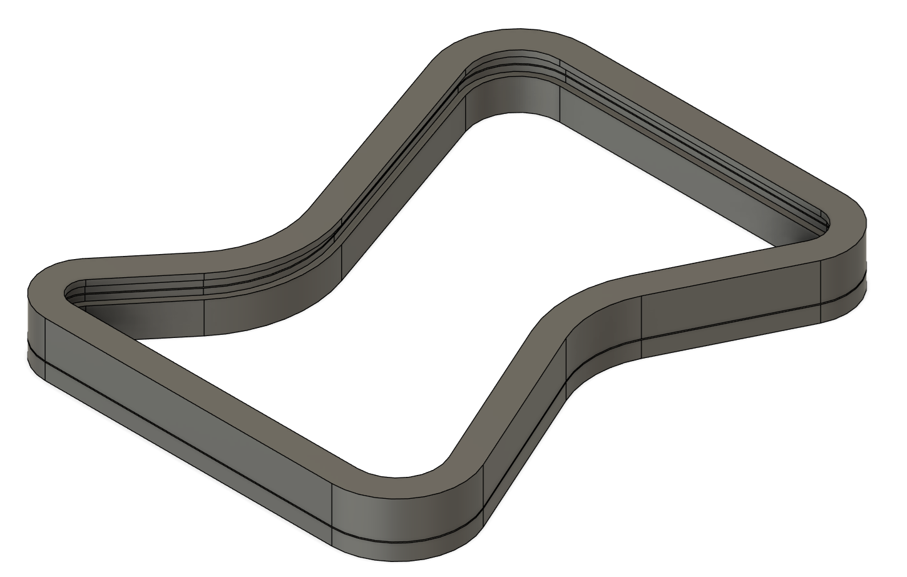
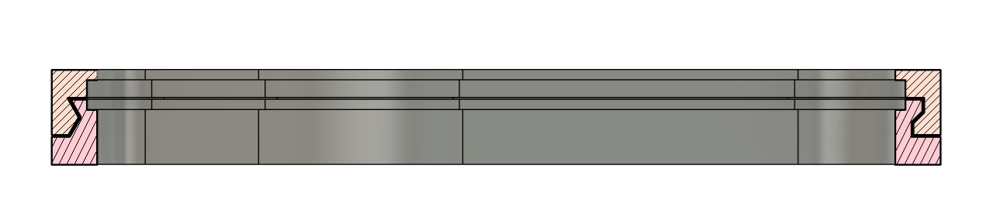
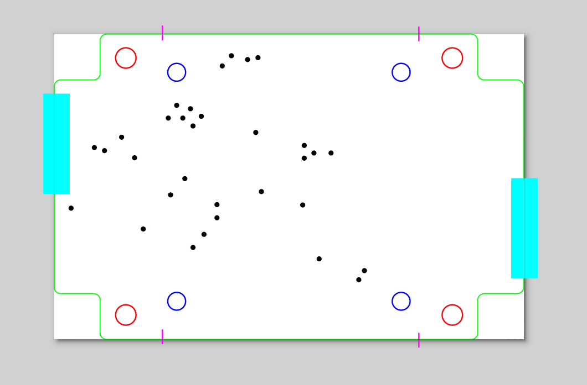
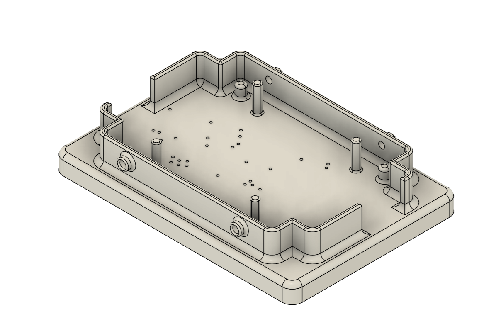

# PCB Enclosure & Test Bench Generator

This project is a parametric CAD generator that creates **3D printable enclosures** and **test benches/fixtures** directly from PCB SVG outlines.

Built using [CadQuery](https://github.com/CadQuery/cadquery) and [svgpathtools](https://pypi.org/project/svgpathtools/), this tool analyzes 2D SVG layers (distinguished by stroke color) to generate complex, sweeping 3D geometry.

## Features

* **Parametric Generation:** Fully adjustable dimensions (wall thickness, PCB thickness, clearances, screw sizes) via CLI arguments.
* **SVG-Driven Design:** Define the geometry and special features (clips, screws, supports) visually in your vector graphics editor (e.g., Inkscape, Illustrator) using color codes.
* **Interlocking Box Design (`box.py`):**
    * Generates two halves (inner/outer) that slide/snap together.
    * Supports custom profiles: **Z-profile** (locking step), **C-profile** (chamfered), and **S-profile** (simple notch).
    * Automatic PCB slot generation and support structures.
* **Test Bench / Jig Design (`bench.py`):**
    * **Pogo Pin Testing:** Generates a mounting plate with precise holes for pogo pins (spring-loaded contacts).
    * **Clamping Mechanism:** Generates mounts for **ballscrews or clamps** to apply pressure, ensuring reliable electrical contact between the PCB and pogo pins.
    * **Easy Extraction:** Automatically generates wall cutouts ("fingers") to allow users to easily grab and **remove the PCB from the fixture**.
    * **Fabrication Ready:** Exports both 3D models (STEP) and 2D fabrication files (SVG).

***

## Requirements

* Python 3.x
* [CadQuery](https://cadquery.readthedocs.io/)
* [numpy](https://numpy.org/)
* [svgpathtools](https://pypi.org/project/svgpathtools/)
* [shapely](https://pypi.org/project/shapely/)

```bash
pip install cadquery numpy svgpathtools shapely
```

***

## 1. SVG Input Specification

The tools rely on **Stroke Color** to identify different parts of the PCB geometry. Ensure your SVG uses the following hex codes for stroke colors.

### For Box Generator (`box.py`)

| Feature     | Color | Hex Code  | Description                                                               |
|:------------|:------|:----------|:--------------------------------------------------------------------------|
| **Outline** | Black | `#000000` | The main perimeter of the PCB  that use the **S-profile** (simple notch). |
| **Anchor**  | Red   | `#ff0000` | Segments of the perimeter that use the **Z-profile** (locking step).      |
| **Clip**    | Green | `#00ff00` | Segments of the perimeter that use the **C-profile** (chamfered/snap).    |

*Note: Any segment not marked as Anchor or Clip will default to the standard Outline profile.*

### For Bench Generator (`bench.py`)

| Feature     | Color   | Hex Code  | Description                                                              |
|:------------|:--------|:----------|:-------------------------------------------------------------------------|
| **Outline** | Green   | `#00ff00` | The main perimeter of the PCB.                                           |
| **Support** | Red     | `#ff0000` | Support pillars underneath the PCB.                                      |
| **Hole**    | Black   | `#000000` | Cutouts or holes through the bench base.                                 |
| **Filler**  | Blue    | `#0000ff` | Guide pins/columns protruding through PCB holes.                         |
| **Screw**   | Magenta | `#ff00ff` | Locations for ballscrew/clamp mounts to press the PCB against pogo pins. |
| **Finger**  | Cyan    | `#00ffff` | Cutouts in the wall to allow fingers to easily grasp and remove the PCB. |

***

## 2. Generating an Enclosure (`box.py`)

Generates a 2-part interlocking case.

### Usage
```bash
python box.py [options] input.svg output_file.step
```

### Key Arguments

| Argument                 | Flag                           | Default    | Description                                                                                                                     |
|:-------------------------|:-------------------------------|:-----------|:--------------------------------------------------------------------------------------------------------------------------------|
| **SVG Input**            | (Positional)                   | N/A        | Path to the PCB SVG input file.                                                                                                 |
| **Output File**          | (Positional)                   | N/A        | Path to the output file (e.g., `.step` or `.stl`).                                                                              |
| **Log Verbosity**        | `-v`, `--verbose`              | 0          | Increases log verbosity for debugging.                                                                                          |
| **PCB Thickness**        | `-t`, `--pcb-thickness`        | $1.6$      | Thickness of the PCB in mm.                                                                                                     |
| **PCB Z-Offset**         | `-z`, `--pcb-z`                | $1.2$      | Vertical offset (Z-axis) of the PCB's center plane relative to the junction center in mm.                                       |
| **PCB Clearance**        | `-w`, `--pcb-clearance-offset` | $0.15$     | Clearance distance (in mm) between the PCB outline and the surrounding enclosure walls/slots.                                   |
| **PCB Cover Offset**     | `-u`, `--pcb-cover-offset`     | $0.4$      | Distance (in mm) the internal support lip extends over the surface of the PCB edge.                                             |
| **PCB Support Angle**    | `--pcb-support-angle`          | $45.0$     | Angle (in degrees) of the slanted internal support lip holding the PCB.                                                         |
| **Disable PCB Features** | `--disable-pcb`                | `False`    | If set, prevents the generation of internal PCB features (slots, supports).                                                     |
| **Wall Thickness (Min)** | `-n`, `--wall-thickness`       | $0.88$     | Minimum wall thickness (in mm).                                                                                                 |
| **Wall Offset**          | `-o`, `--wall-offset`          | $-0.4$     | Offset distance (in mm) applied to the PCB outline to determine the inner wall perimeter. Negative values move the wall inward. |
| **Wall Extra Height**    | `-m`, `--wall-extra`           | $1.5$      | Extra wall height (in mm) extending above and below the main junction line.                                                     |
| **Junction Height**      | `-y`, `--junction-height`      | $2.0$      | Total height (in mm) of the section between the two interlocking box halves.                                                    |
| **Junction Width**       | `-x`, `--junction-width`       | $1.0$      | Horizontal width (in mm) of the section between the two interlocking box halves.                                                |
| **Junction Flipped**     | `-f`, `--junction-flipped`     | `False`    | Flips the junction profile, reversing the inner/outer lip placement.                                                            |
| **Z-Profile Angle**      | `--z-angle`                    | $30.0$     | Angle (in degrees) used for the slanted edge of the Z-profile junction.                                                         |
| **C-Profile Angle**      | `--c-angle`                    | $60.0$     | Angle (in degrees) used for the chamfered edge of the C-profile junction.                                                       |
| **SVG Scale Factor**     | `-s`, `--scale`                | $0.264583$ | Scaling factor to convert SVG coordinates to working units (mm).                                                                |
| **Mechanical Play**      | `-p`, `--play`                 | $0.10$     | Mechanical clearance (tolerance) applied between interlocking parts/features in mm.                                             |

---
### Example

```bash
python box.py -s 1.0 box.svg box.step
```

| File Name  | Description                                                               | Image                                                                                                                        |
|:-----------|:--------------------------------------------------------------------------|:-----------------------------------------------------------------------------------------------------------------------------|
| `box.svg`  | The 2D input outline used to generate the CAD model.                      |                                        |
| `box.step` | The resulting 3D model of the complete enclosure.                         |                                                 |
| `box.step` | Cross-section view showing the locking Z-profile and chamfered C-profile. |  |
| `box.step` | Cross-section view showing the simple notch S-profile.                    |                |

***

## 3. Generating a Test Bench (`bench.py`)

Generates a rugged mounting plate/jig designed for manufacturing tests or flashing.

### Usage
```bash
python bench.py [options] input.svg output_file.step
```

### Key Arguments

| Argument                     | Flag                          | Default    | Description                                                                                      |
|:-----------------------------|:------------------------------|:-----------|:-------------------------------------------------------------------------------------------------|
| **SVG Input**                | (Positional)                  | N/A        | Path to the PCB SVG input outline file.                                                          |
| **Output File**              | (Positional)                  | N/A        | Path to the output file (e.g., `.step` or `.stl`).                                               |
| **Log Verbosity**            | `-v`, `--verbose`             | 0          | Increases log verbosity for debugging.                                                           |
| **PCB Thickness**            | `-t`, `--pcb-thickness`       | $1.6$      | Thickness of the PCB in mm.                                                                      |
| **Base Plate Thickness**     | `-b`, `--bottom`              | $8.0$      | Thickness (in mm) of the main bench base plate.                                                  |
| **Under PCB Space**          | `-u`, `--under-space`         | $5.0$      | Vertical clearance (in mm) between the bottom of the PCB and the top of the bench base plate.    |
| **Pogo Pin Diameter**        | `-d`, `--pin-diameter`        | $0.95$     | Diameter (in mm) for the pogo pin holes.                                                         |
| **Wall Thickness (Side)**    | `--wall-thickness`            | $2.0$      | Thickness (in mm) of the protective side walls surrounding the PCB.                              |
| **Wall Fillet**              | `--wall-fillet`               | $2.0$      | Fillet radius (in mm) applied to the side wall corners.                                          |
| **Wall Height**              | `--wall-height`               | $5.0$      | Height (in mm) of the protective side walls.                                                     |
| **Wall Play**                | `--wall-play`                 | $0.4$      | Lateral clearance (in mm) between the PCB perimeter and the walls.                               |
| **Filler Pin Height**        | `--filler-height`             | $5.0$      | Height (in mm) of the guide pins/columns (Fillers, Blue SVG) protruding through PCB holes.       |
| **Fixture Screw Hole Dia.**  | `--fixture-screw-hole`        | $2.8$      | Diameter (in mm) for the hole that mounts the fixture clamping mechanism.                        |
| **Fixture Screw Boss Dia.**  | `--fixture-screw-diameter`    | $5.0$      | Outer diameter (in mm) of the boss/standoff feature for the clamping mechanism.                  |
| **Fixture Screw Z-Offset**   | `--fixture-screw-offset`      | $0.5$      | Z-offset (in mm) of the clamp's contact surface relative to the top surface of the PCB.          |
| **Fixture Screw Extra Wall** | `--fixture-screw-extra`       | $3.0$      | Extra wall thickness (in mm) added to reinforce the fixture screw boss/standoff.                 |
| **Support Fillet**           | `--support-fillet`            | $1.0$      | Fillet radius (in mm) applied to the top edges of PCB support features.                          |
| **Filler Fillet**            | `--filler-fillet`             | $0.5$      | Fillet radius (in mm) applied to the top edges of filler/guide pins.                             |
| **Extra Fillet Level**       | `--extra-fillet`              | $4$        | Enables or sets the size/iteration of extra, secondary fillets applied to global features.       |
| **Box Wall Thickness**       | `--box-wall-thickness`        | $2.0$      | Thickness (in mm) of the walls/standoffs used for mounting the entire test bench assembly.       |
| **Box Screw Diameter**       | `--box-screw-diameter`        | $2.45$     | Diameter (in mm) of the screw holes for mounting the entire test bench assembly.                 |
| **Box Screw Offset**         | `--box-screw-offset`          | $1.00$     | Depth (in mm) of the counterbore or screw head cavity relative to the top of the mounting plate. |
| **SVG Scale Factor**         | `-z`, `--scale`               | $0.264583$ | Scaling factor to convert SVG coordinates to working units (mm).                                 |
| **Mechanical Play**          | `-p`, `--play`                | $0.15$     | Mechanical clearance (tolerance) applied between manufactured parts/features in mm.              |
| **Mirrored**                 | `-m`, `--mirrored`            | False      | If set, mirrors the SVG geometry along the X-axis (top-bottom flip).                             |

### Example
```bash
python bench.py -vvvvvv -m jig.svg jig.step
```

| File Name  | Description                                            | Image                                                                           |
|:-----------|:-------------------------------------------------------|:--------------------------------------------------------------------------------|
| `jig.svg`  | The 2D input outline used to generate the CAD model.   |                 |
| `jig.step` | The resulting 3D model of the complete test bench/jig. |  |
***

## Technical Details

### Scaling Note

SVG editors (like Inkscape) and PCB CAD software exporters (like Altium's SVG output) often handle units differently, requiring a scaling factor to convert the graphic's units (usually pixels) into the working units (millimeters) required by the generator.

If your dimensions are incorrect, you must **check your SVG DPI settings** (in your editor or your PCB CAD software's export options) or adjust the scale argument (`-s` or `-z`).

* The default scale factor of $0.264583$ assumes the SVG uses pixels based on the 96 DPI standard (common in Inkscape and often the default for modern exports like Altium's).
    * 1 px @ 96 DPI = $0.264583$ mm.
* If your SVG editor or exporter uses 72 DPI (an older or different standard), the correct scale factor is $0.352778$.
    * 1 px @ 72 DPI = $0.352778$ mm.